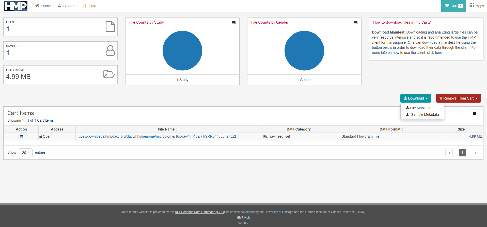

# HMPGetFile: Simple Script to retrieve file from Human Microbiome Project Database
A quick script to retrieve files from the [NIH Human Microbiome Project][HMPLink] in AWS S3 from Manifest File

## Running the script
###Installing the environment
We recommended to use conda to install the python environment. To install the environment, use:

```bash
conda create -n HMPretriever python==3.11.11
```
To install the packages, use:

```bash
pip install -r requirements.txt 
```

## Retriving the manifest file in the [NIH Human Microbiome Project][HMPLink]
To obtain the manifest file, after adding the files that you need into the shopping cart at the [hmpdacc portal][https://portal.hmpdacc.org/], go to **Cart** at the top right hand corner and a summary of all the files added are shown just like below. Press **download** and **File Manifest**. A _.tsv_ file should be downloaded.

<p align="center">
</p>

## Download the data from the manifest.tsv
To download the files inside the manifest file, use the following command:

```bash
python downloadHMP.py -v -i path_to_manifest.tsv -o output_directory/ 
```
The downloaded data should be stored in `output_directory/`. _successful_manifest.tsv_ shows the list of files successfully found and retrieved while _failed_manifest.tsv_ shows the opposite.

[HMPlink]: https://hmpdacc.org/hmp/
